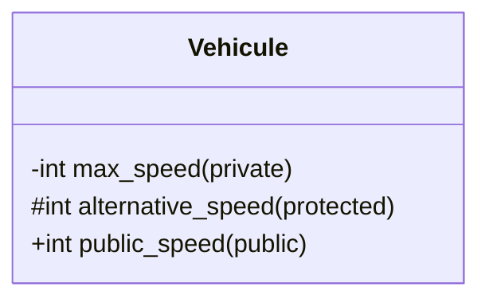

# Note sur les niveaux d'accès en C++ avec l'héritage

## Les trois niveaux d'accès en C++

### 1. `private` (privé)
- **Accessible uniquement** par la classe elle-même
- **PAS accessible** par les classes dérivées (enfants)
- **PAS accessible** de l'extérieur

```cpp
class Vehicule {
private:
    int max_speed;  // Accessible uniquement dans Vehicule
};

class Bus : public Vehicule {
public:
    void afficher() {
        // ERREUR : on ne peut pas accéder à max_speed ici !
        // cout << this->max_speed;  // ❌ Ne compile pas
    }
};
```

### 2. `protected` (protégé)
- **Accessible** par la classe elle-même
- **Accessible** par les classes dérivées (enfants)
- **PAS accessible** de l'extérieur

```cpp
class Vehicule {
protected:
    int max_speed;  // Accessible dans Vehicule ET ses classes dérivées
};

class Bus : public Vehicule {
public:
    void afficher() {
        // OK : on peut accéder à max_speed ici !
        cout << this->max_speed;  // ✅ Compile correctement
    }
};
```

### 3. `public` (public)
- **Accessible** partout : dans la classe, les classes dérivées, et l'extérieur

```cpp
class Vehicule {
public:
    int max_speed;  // Accessible partout
};

int main() {
    Vehicule v;
    v.max_speed = 200;  // ✅ OK
}
```

## Tableau récapitulatif

| Niveau d'accès | Classe elle-même | Classes dérivées | Extérieur |
|----------------|------------------|------------------|-----------|
| `private`      | ✅ Oui           | ❌ Non           | ❌ Non    |
| `protected`    | ✅ Oui           | ✅ Oui           | ❌ Non    |
| `public`       | ✅ Oui           | ✅ Oui           | ✅ Oui    |

## Application à l'exercice 1

### Situation actuelle (avec `private`)

```cpp
class Vehicule {
private:
    int max_speed;
    int mileage;
public:
    int getmax_speed() { return max_speed; }
    int getmileage() { return mileage; }
};

class Bus : public Vehicule {
public:
    void get_info() {
        // On DOIT utiliser les getters car max_speed est private
        cout << "vitesse maximale de " << getmax_speed() << " kmh";
    }
};
```

### Alternative avec `protected`

```cpp
class Vehicule {
protected:  // ⬅️ Changé de private à protected
    int max_speed;
    int mileage;
public:
    int getmax_speed() { return max_speed; }
    int getmileage() { return mileage; }
};

class Bus : public Vehicule {
public:
    void get_info() {
        // On PEUT accéder directement car max_speed est protected
        cout << "vitesse maximale de " << max_speed << " kmh";
        // OU utiliser les getters (toujours valide)
        cout << "vitesse maximale de " << getmax_speed() << " kmh";
    }
};
```

## Quelle approche choisir ?

### Utiliser `private` + getters/setters ✅ (Recommandé)
**Avantages :**
- Meilleure encapsulation
- Contrôle total sur l'accès aux données
- Possibilité d'ajouter de la validation dans les getters/setters
- Respect strict du principe d'encapsulation

**Inconvénients :**
- Plus verbeux (il faut appeler les getters/setters)

### Utiliser `protected`
**Avantages :**
- Accès direct aux attributs dans les classes dérivées
- Code plus concis

**Inconvénients :**
- Moins d'encapsulation
- Les classes dérivées peuvent modifier directement les attributs
- Plus difficile de contrôler l'accès

## Bonne pratique

En général, on préfère **`private` avec des getters/setters****, car cela offre :
- Une meilleure encapsulation
- Plus de flexibilité pour ajouter de la logique de validation
- Un meilleur contrôle sur qui peut modifier quoi

On utilise `protected` quand :
- Les classes dérivées ont vraiment besoin d'un accès direct
- On veut permettre aux enfants de modifier l'état interne
- La hiérarchie de classes est bien contrôlée et documentée

## En notation UML

Dans le diagramme de classes, les symboles sont :
- `-` : private (privé)
- `#` : protected (protégé)
- `+` : public (public)


