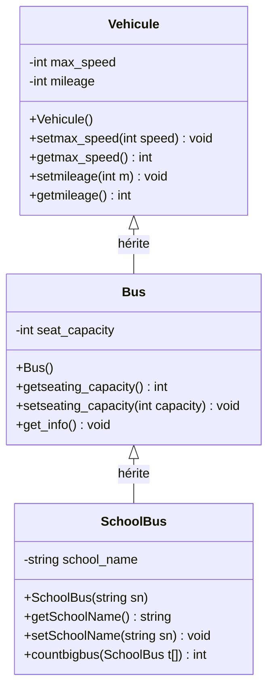

# Exercice 1 - Workshop Héritage (Vehicules et Bus)

## Diagramme de classes



## Solution

### Fichier: Vehicule.h

```cpp
#ifndef VEHICULE_H
#define VEHICULE_H

class Vehicule {
private:
    int max_speed;
    int mileage;

public:
    // Constructeur
    Vehicule();

    // Getters et Setters pour max_speed
    void setmax_speed(int speed);
    int getmax_speed();

    // Getters et Setters pour mileage
    void setmileage(int m);
    int getmileage();
};

#endif
```

### Fichier: Vehicule.cpp

```cpp
#include "Vehicule.h"

// Constructeur initialisant max_speed à 240 et mileage à 0
Vehicule::Vehicule() {
    max_speed = 240;
    mileage = 0;
}

// Setter pour max_speed avec validation
void Vehicule::setmax_speed(int speed) {
    if (speed > 0 && speed <= 200) {
        max_speed = speed;
    } else {
        max_speed = 240;
    }
}

// Getter pour max_speed
int Vehicule::getmax_speed() {
    return max_speed;
}

// Setter pour mileage avec validation
void Vehicule::setmileage(int m) {
    if (m >= 0) {
        mileage = m;
    } else {
        mileage = 0;
    }
}

// Getter pour mileage
int Vehicule::getmileage() {
    return mileage;
}
```

### Fichier: Bus.h

```cpp
#ifndef BUS_H
#define BUS_H

#include "Vehicule.h"

class Bus : public Vehicule {
private:
    int seat_capacity;

public:
    // Constructeur
    Bus();

    // Getters et Setters pour seat_capacity
    int getseating_capacity();
    void setseating_capacity(int capacity);

    // Méthode pour afficher les informations du bus
    void get_info();
};

#endif
```

### Fichier: Bus.cpp

```cpp
#include "Bus.h"
#include <iostream>
using namespace std;

// Constructeur initialisant seat_capacity à 10
Bus::Bus() : Vehicule() {
    seat_capacity = 10;
}

// Getter pour seat_capacity
int Bus::getseating_capacity() {
    return seat_capacity;
}

// Setter pour seat_capacity avec validation
void Bus::setseating_capacity(int capacity) {
    if (capacity >= 10 && capacity <= 50) {
        seat_capacity = capacity;
    } else {
        seat_capacity = 50;
    }
}

// Méthode pour afficher les informations du bus
void Bus::get_info() {
    cout << "Il s'agit d'un bus d'une capacité de " << seat_capacity
         << " places, avec une vitesse maximale de " << getmax_speed()
         << " kmh et son kilométrage est de " << getmileage() << " km." << endl;
}
```

### Fichier: SchoolBus.h

```cpp
#ifndef SCHOOLBUS_H
#define SCHOOLBUS_H

#include "Bus.h"
#include <string>
using namespace std;

class SchoolBus : public Bus {
private:
    string school_name;

public:
    // Constructeur
    SchoolBus(string sn);

    // Getter pour school_name
    string getSchoolName();

    // Setter pour school_name
    void setSchoolName(string sn);

    // Méthode statique pour compter les bus avec capacité > 40
    static int countbigbus(SchoolBus t[], int size);
};

#endif
```

### Fichier: SchoolBus.cpp

```cpp
#include "SchoolBus.h"

// Constructeur
SchoolBus::SchoolBus(string sn) : Bus() {
    school_name = sn;
}

// Getter pour school_name
string SchoolBus::getSchoolName() {
    return school_name;
}

// Setter pour school_name
void SchoolBus::setSchoolName(string sn) {
    school_name = sn;
}

// Méthode statique pour compter les SchoolBus avec capacité > 40
int SchoolBus::countbigbus(SchoolBus t[], int size) {
    int count = 0;
    for (int i = 0; i < size; i++) {
        if (t[i].getseating_capacity() > 40) {
            count++;
        }
    }
    return count;
}
```

### Fichier: main.cpp

```cpp
#include <iostream>
#include "Vehicule.h"
#include "Bus.h"
#include "SchoolBus.h"
using namespace std;

int main() {
    // Test de la classe Vehicule
    cout << "=== Test Vehicule ===" << endl;
    Vehicule v1;
    cout << "Vehicule - Max speed: " << v1.getmax_speed() << " km/h" << endl;
    cout << "Vehicule - Mileage: " << v1.getmileage() << " km" << endl;

    v1.setmax_speed(180);
    v1.setmileage(50000);
    cout << "Après modification:" << endl;
    cout << "Max speed: " << v1.getmax_speed() << " km/h" << endl;
    cout << "Mileage: " << v1.getmileage() << " km" << endl;

    // Test de la classe Bus
    cout << "\n=== Test Bus ===" << endl;
    Bus b1;
    b1.setmax_speed(120);
    b1.setmileage(200000);
    b1.setseating_capacity(40);
    b1.get_info();

    // Test de la classe SchoolBus
    cout << "\n=== Test SchoolBus ===" << endl;
    SchoolBus sb1("École Primaire Jean Jaurès");
    sb1.setmax_speed(90);
    sb1.setmileage(150000);
    sb1.setseating_capacity(45);

    cout << "SchoolBus - École: " << sb1.getSchoolName() << endl;
    sb1.get_info();

    // Test de countbigbus
    cout << "\n=== Test countbigbus ===" << endl;
    SchoolBus buses[5] = {
        SchoolBus("École A"),
        SchoolBus("École B"),
        SchoolBus("École C"),
        SchoolBus("École D"),
        SchoolBus("École E")
    };

    buses[0].setseating_capacity(35);
    buses[1].setseating_capacity(45);
    buses[2].setseating_capacity(42);
    buses[3].setseating_capacity(30);
    buses[4].setseating_capacity(50);

    int bigBusCount = SchoolBus::countbigbus(buses, 5);
    cout << "Nombre de bus scolaires avec capacité > 40: " << bigBusCount << endl;

    return 0;
}
```

## Compilation et Exécution

```bash
# Compilation
g++ -o vehicule main.cpp Vehicule.cpp Bus.cpp SchoolBus.cpp

# Exécution
./vehicule
```

## Points clés de la solution

1. **Héritage**: Bus hérite de Vehicule, SchoolBus hérite de Bus
2. **Encapsulation**: Attributs privés avec getters/setters publics
3. **Validation**: Les setters vérifient les valeurs avant de les affecter
4. **Constructeurs**: Chaque classe initialise ses attributs avec des valeurs par défaut
5. **Méthode statique**: countbigbus est une méthode statique qui ne dépend pas d'une instance particulière
