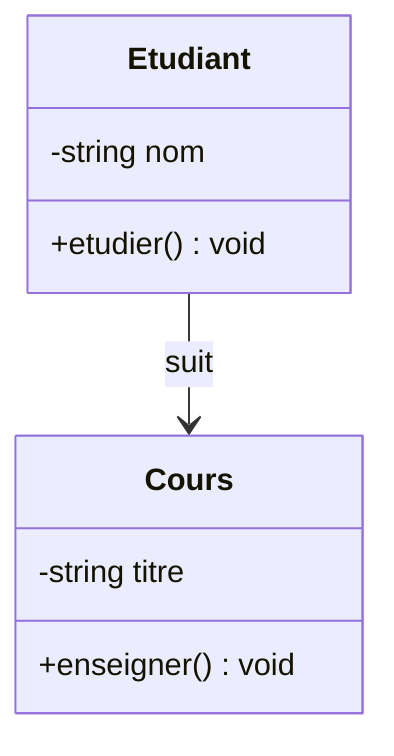
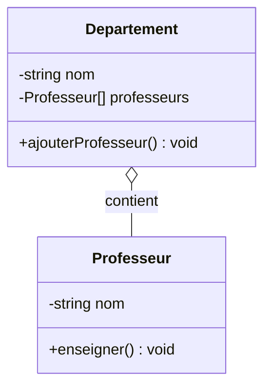
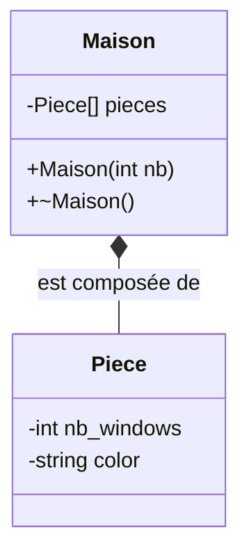
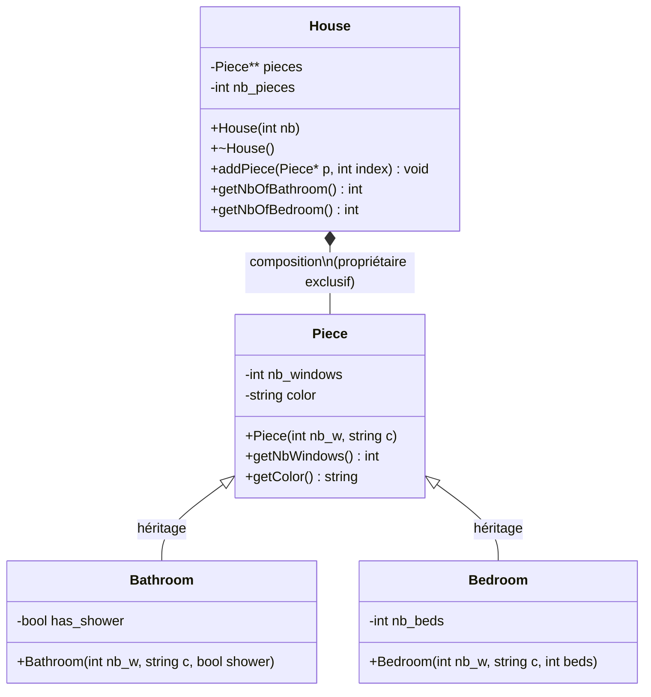

# Note sur les relations entre classes en POO

## Les trois types de relations

En programmation orientée objet, il existe trois types principaux de relations entre classes :

### 1. Association

**Définition :** Une relation faible où les objets sont indépendants. Un objet peut exister sans l'autre.

**Caractéristiques :**
- Les deux objets ont leur propre cycle de vie
- Aucun objet ne possède l'autre
- Relation de type "utilise" ou "connaît"

**Notation UML :** Ligne simple



**Exemple en C++ :**
```cpp
class Cours {
public:
    string titre;
};

class Etudiant {
private:
    Cours* cours;  // Référence vers un cours
public:
    void suivreCours(Cours* c) {
        cours = c;  // L'étudiant ne crée pas le cours
    }
};

int main() {
    Cours* maths = new Cours();
    Etudiant* alice = new Etudiant();

    alice->suivreCours(maths);  // Association

    delete alice;  // alice est supprimée
    // mais maths existe toujours
    delete maths;
}
```

---

### 2. Agrégation

**Définition :** Une relation "a un" (has-a) où le conteneur possède les objets mais ils peuvent exister indépendamment.

**Caractéristiques :**
- Relation de type "a un" plus forte que l'association
- Les objets contenus peuvent exister sans le conteneur
- Le conteneur ne détruit pas les objets contenus quand il est détruit

**Notation UML :** Ligne avec losange vide



**Exemple en C++ :**
```cpp
class Professeur {
public:
    string nom;
};

class Departement {
private:
    vector<Professeur*> professeurs;  // Agrégation
public:
    void ajouterProfesseur(Professeur* p) {
        professeurs.push_back(p);
    }

    ~Departement() {
        // On ne supprime PAS les professeurs
        // Ils peuvent exister après la destruction du département
    }
};

int main() {
    Professeur* prof = new Professeur();
    Departement* dept = new Departement();

    dept->ajouterProfesseur(prof);

    delete dept;  // Le département est détruit
    // mais prof existe encore !
    delete prof;  // Il faut le supprimer manuellement
}
```

---

### 3. Composition

**Définition :** Une relation "a un" (has-a) forte où le conteneur possède ET contrôle le cycle de vie des objets contenus.

**Caractéristiques :**
- Relation de type "a un" très forte
- Les objets contenus ne peuvent PAS exister sans le conteneur
- Quand le conteneur est détruit, les objets contenus sont aussi détruits
- Le conteneur est responsable de la création ET de la destruction

**Notation UML :** Ligne avec losange plein



**Exemple en C++ :**
```cpp
class Piece {
public:
    int nb_windows;
    string color;
    Piece(int w, string c) : nb_windows(w), color(c) {}
};

class Maison {
private:
    Piece** pieces;
    int nb_pieces;
public:
    Maison(int nb) {
        nb_pieces = nb;
        pieces = new Piece*[nb_pieces];
        for (int i = 0; i < nb_pieces; i++) {
            pieces[i] = nullptr;
        }
    }

    ~Maison() {
        // COMPOSITION : la maison détruit ses pièces
        for (int i = 0; i < nb_pieces; i++) {
            if (pieces[i] != nullptr) {
                delete pieces[i];  // Destruction des composants
            }
        }
        delete[] pieces;
    }

    void addPiece(Piece* piece, int index) {
        pieces[index] = piece;
    }
};
```

---

## Tableau comparatif

| Critère | Association | Agrégation | Composition |
|---------|-------------|------------|-------------|
| **Relation** | "utilise" / "connaît" | "a un" (faible) | "a un" (forte) |
| **UML** | `-->` | `o--` (losange vide) | `*--` (losange plein) |
| **Cycle de vie** | Indépendants | Indépendants | Dépendants |
| **Destruction** | Aucun impact | Aucun impact | Détruit les composants |
| **Exemple** | Étudiant ↔ Cours | Département ↔ Professeurs | Maison ↔ Pièces |

---

## Problème avec l'implémentation actuelle de House

### Le code proposé dans l'exercice

```cpp
House myHouse(5);
myHouse.addPiece(new Bedroom(2, "Bleu", 2), 0);
```

**✅ Ce code est correct** car :
- La pièce est créée directement dans l'appel à `addPiece()`
- Elle n'existe pas en dehors de `myHouse`
- C'est une vraie composition

### Le problème potentiel

Cependant, rien n'empêche de faire cette **erreur** :

```cpp
Piece* p1 = new Piece(2, "Rouge");  // ❌ Pièce créée indépendamment
Bedroom* b1 = new Bedroom(1, "Vert", 1);  // ❌ Chambre créée indépendamment

House myHouse(5);
myHouse.addPiece(p1, 0);   // ⚠️ Problème !
myHouse.addPiece(b1, 1);   // ⚠️ Problème !

// Plus tard...
delete myHouse;  // Supprime p1 et b1 via le destructeur

// ❌ ERREUR : p1 et b1 ont déjà été supprimés !
// Si on essaie de les utiliser ou de les supprimer à nouveau = crash
```

### Pourquoi est-ce un problème ?

1. **Violation de la composition** : Les pièces existent indépendamment de la maison
2. **Gestion de la mémoire ambiguë** : Qui est responsable de supprimer p1 et b1 ?
3. **Risque de double suppression** : Si on fait `delete p1` après `delete myHouse`, c'est un crash
4. **Ce n'est plus une vraie composition** : C'est devenu une agrégation

### Solution 1 : Méthode de création dédiée (Recommandée)

Au lieu de passer un pointeur, créer la pièce dans la maison :

```cpp
class House {
public:
    void createBedroom(int nb_w, string c, int beds, int index) {
        if (index >= 0 && index < this->nb_pieces) {
            this->pieces[index] = new Bedroom(nb_w, c, beds);
        }
    }

    void createBathroom(int nb_w, string c, bool shower, int index) {
        if (index >= 0 && index < this->nb_pieces) {
            this->pieces[index] = new Bathroom(nb_w, c, shower);
        }
    }
};

// Utilisation :
int main() {
    House myHouse(5);
    myHouse.createBedroom(2, "Bleu", 2, 0);  // ✅ Vraie composition
    myHouse.createBathroom(1, "Blanc", true, 1);  // ✅ Vraie composition
}
```

**Avantages** :
- ✅ Impossible de passer un pointeur existant
- ✅ La maison contrôle totalement le cycle de vie
- ✅ Vraie composition garantie

### Solution 2 : Constructeur de House avec initialisation

```cpp
class House {
public:
    House(vector<Piece*> pieces_initiales) {
        nb_pieces = pieces_initiales.size();
        pieces = new Piece*[nb_pieces];
        for (int i = 0; i < nb_pieces; i++) {
            pieces[i] = pieces_initiales[i];
        }
    }
};

// Utilisation :
int main() {
    House myHouse({
        new Bedroom(2, "Bleu", 2),
        new Bathroom(1, "Blanc", true),
        new Bedroom(1, "Rose", 1)
    });
    // ✅ Les pièces sont créées dans le constructeur
}
```

### Solution 3 : Passer la propriété explicitement (move semantics)

En C++11 et plus :

```cpp
class House {
public:
    void addPiece(unique_ptr<Piece> piece, int index) {
        if (index >= 0 && index < nb_pieces) {
            pieces[index] = piece.release();  // Transfert de propriété
        }
    }
};

// Utilisation :
int main() {
    House myHouse(5);
    myHouse.addPiece(make_unique<Bedroom>(2, "Bleu", 2), 0);
    // ✅ Le unique_ptr garantit qu'il n'y a qu'un seul propriétaire
}
```

---

## Diagramme récapitulatif de l'exercice 2



**Note importante :** Le losange plein `*--` indique la composition, mais l'implémentation actuelle ne la garantit pas totalement à cause de la méthode `addPiece(Piece*)`.

---

## Conclusion

L'implémentation actuelle de l'exercice 2 fonctionne correctement **SI** on l'utilise comme prévu (création inline des pièces). Cependant, elle n'empêche pas les erreurs d'utilisation qui violeraient le principe de composition.

Pour une vraie composition stricte, il vaudrait mieux utiliser une des solutions proposées ci-dessus qui garantissent que les pièces ne peuvent exister qu'à travers la maison.
