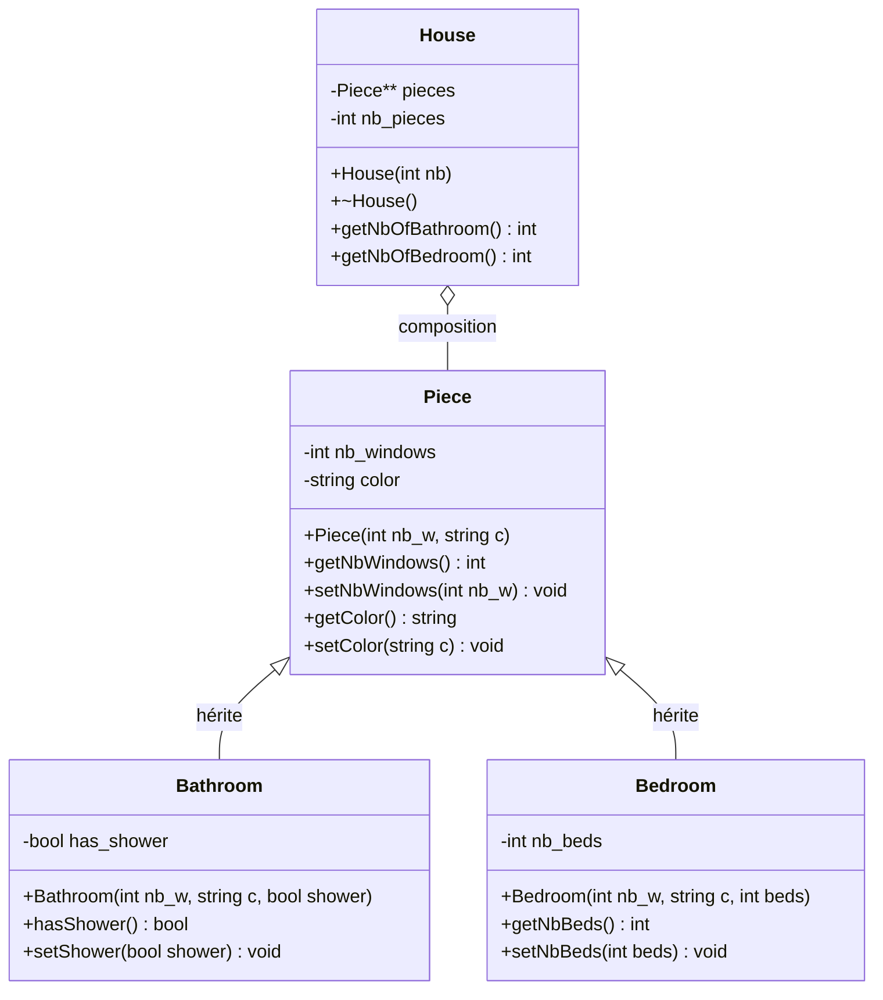

# Exercice 2 - Maquette d'une Maison

## Diagramme de classes



## Solution

### Fichier: Piece.h

```cpp
#ifndef PIECE_H
#define PIECE_H

#include <string>
using namespace std;

class Piece {
private:
    int nb_windows;
    string color;

public:
    // Constructeur
    Piece(int nb_w, string c);

    // Getters et Setters
    int getNbWindows();
    void setNbWindows(int nb_w);
    string getColor();
    void setColor(string c);

    // Destructeur virtuel pour permettre le polymorphisme
    virtual ~Piece() {}
};

#endif
```

### Fichier: Piece.cpp

```cpp
#include "Piece.h"

// Constructeur
Piece::Piece(int nb_w, string c) {
    nb_windows = nb_w;
    color = c;
}

// Getter pour nb_windows
int Piece::getNbWindows() {
    return nb_windows;
}

// Setter pour nb_windows
void Piece::setNbWindows(int nb_w) {
    nb_windows = nb_w;
}

// Getter pour color
string Piece::getColor() {
    return color;
}

// Setter pour color
void Piece::setColor(string c) {
    color = c;
}
```

### Fichier: Bathroom.h

```cpp
#ifndef BATHROOM_H
#define BATHROOM_H

#include "Piece.h"

class Bathroom : public Piece {
private:
    bool has_shower;

public:
    // Constructeur
    Bathroom(int nb_w, string c, bool shower);

    // Getters et Setters
    bool hasShower();
    void setShower(bool shower);
};

#endif
```

### Fichier: Bathroom.cpp

```cpp
#include "Bathroom.h"

// Constructeur
Bathroom::Bathroom(int nb_w, string c, bool shower) : Piece(nb_w, c) {
    has_shower = shower;
}

// Getter pour has_shower
bool Bathroom::hasShower() {
    return has_shower;
}

// Setter pour has_shower
void Bathroom::setShower(bool shower) {
    has_shower = shower;
}
```

### Fichier: Bedroom.h

```cpp
#ifndef BEDROOM_H
#define BEDROOM_H

#include "Piece.h"

class Bedroom : public Piece {
private:
    int nb_beds;

public:
    // Constructeur
    Bedroom(int nb_w, string c, int beds);

    // Getters et Setters
    int getNbBeds();
    void setNbBeds(int beds);
};

#endif
```

### Fichier: Bedroom.cpp

```cpp
#include "Bedroom.h"

// Constructeur
Bedroom::Bedroom(int nb_w, string c, int beds) : Piece(nb_w, c) {
    nb_beds = beds;
}

// Getter pour nb_beds
int Bedroom::getNbBeds() {
    return nb_beds;
}

// Setter pour nb_beds
void Bedroom::setNbBeds(int beds) {
    nb_beds = beds;
}
```

### Fichier: House.h

```cpp
#ifndef HOUSE_H
#define HOUSE_H

#include "Piece.h"
#include "Bathroom.h"
#include "Bedroom.h"

class House {
private:
    Piece** pieces;  // Tableau dynamique de pointeurs vers des Pieces
    int nb_pieces;

public:
    // Constructeur
    House(int nb);

    // Destructeur
    ~House();

    // Méthodes pour compter les types de pièces
    int getNbOfBathroom();
    int getNbOfBedroom();

    // Méthode pour ajouter une pièce
    void addPiece(Piece* piece, int index);
};

#endif
```

### Fichier: House.cpp

```cpp
#include "House.h"

// Constructeur - crée un tableau de pointeurs de pièces
House::House(int nb) {
    nb_pieces = nb;
    pieces = new Piece*[nb_pieces];

    // Initialisation à nullptr
    for (int i = 0; i < nb_pieces; i++) {
        pieces[i] = nullptr;
    }
}

// Destructeur - libère la mémoire allouée
House::~House() {
    for (int i = 0; i < nb_pieces; i++) {
        if (pieces[i] != nullptr) {
            delete pieces[i];
        }
    }
    delete[] pieces;
}

// Méthode pour ajouter une pièce
void House::addPiece(Piece* piece, int index) {
    if (index >= 0 && index < nb_pieces) {
        pieces[index] = piece;
    }
}

// Compte le nombre de salles de bain
int House::getNbOfBathroom() {
    int count = 0;
    for (int i = 0; i < nb_pieces; i++) {
        // Utilise dynamic_cast pour vérifier le type
        if (pieces[i] != nullptr && dynamic_cast<Bathroom*>(pieces[i]) != nullptr) {
            count++;
        }
    }
    return count;
}

// Compte le nombre de chambres
int House::getNbOfBedroom() {
    int count = 0;
    for (int i = 0; i < nb_pieces; i++) {
        // Utilise dynamic_cast pour vérifier le type
        if (pieces[i] != nullptr && dynamic_cast<Bedroom*>(pieces[i]) != nullptr) {
            count++;
        }
    }
    return count;
}
```

### Fichier: main.cpp

```cpp
#include <iostream>
#include "House.h"
using namespace std;

int main() {
    // Création d'une maison avec 5 pièces
    House myHouse(5);

    // Ajout de différentes pièces
    myHouse.addPiece(new Bedroom(2, "Bleu", 2), 0);      // Chambre avec 2 fenêtres, bleue, 2 lits
    myHouse.addPiece(new Bedroom(1, "Rose", 1), 1);      // Chambre avec 1 fenêtre, rose, 1 lit
    myHouse.addPiece(new Bathroom(1, "Blanc", true), 2); // Salle de bain avec douche
    myHouse.addPiece(new Bathroom(0, "Gris", false), 3); // Toilettes sans douche
    myHouse.addPiece(new Bedroom(3, "Vert", 2), 4);      // Chambre parentale

    // Affichage des statistiques
    cout << "=== Statistiques de la maison ===" << endl;
    cout << "Nombre de chambres: " << myHouse.getNbOfBedroom() << endl;
    cout << "Nombre de salles de bain: " << myHouse.getNbOfBathroom() << endl;

    return 0;
}
```

## Compilation et Exécution

```bash
# Compilation
g++ -o maison main.cpp Piece.cpp Bathroom.cpp Bedroom.cpp House.cpp

# Exécution
./maison
```

## Points clés de la solution

1. **Héritage**: Bathroom et Bedroom héritent de Piece
2. **Composition**: House contient un tableau de pointeurs vers des Pieces
3. **Polymorphisme**: Utilisation de pointeurs vers la classe de base pour stocker différents types de pièces
4. **Gestion mémoire**: Allocation dynamique avec new et libération avec delete dans le destructeur
5. **RTTI (Run-Time Type Information)**: Utilisation de dynamic_cast pour identifier le type réel des objets
6. **Destructeur virtuel**: Important pour permettre la destruction correcte des objets dérivés via des pointeurs de base
