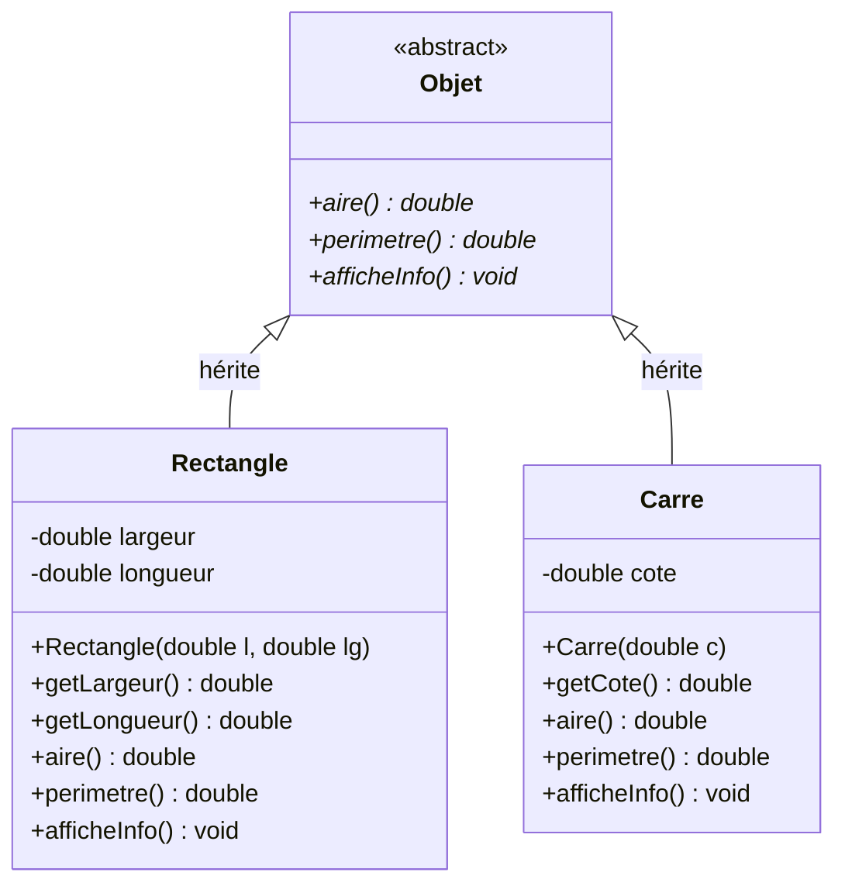
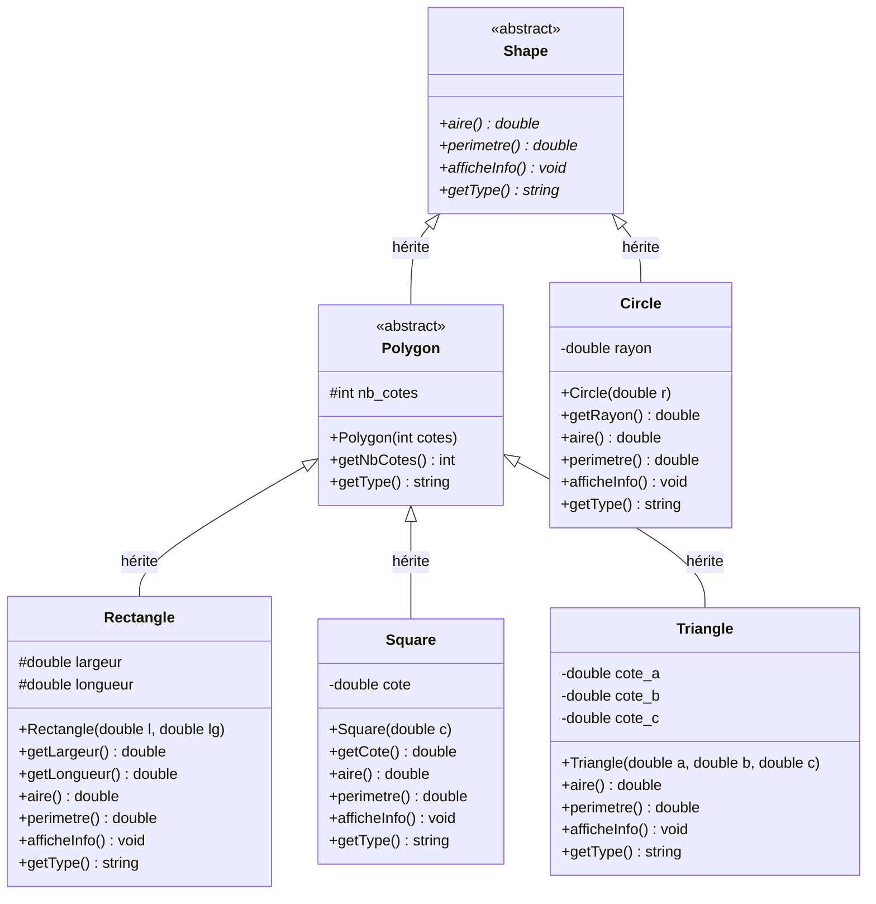

# Exercice 3 - Hiérarchie d'Objets Géométriques

## Analyse du diagramme

Le diagramme représente une hiérarchie de classes pour des objets géométriques:

- **Objet** (classe abstraite): Classe de base définissant l'interface commune
  - `aire()`: méthode virtuelle pure pour calculer l'aire
  - `perimetre()`: méthode virtuelle pure pour calculer le périmètre
  - `afficheInfo()`: méthode virtuelle pure pour afficher les informations

- **Rectangle**: Hérite d'Objet
  - Attributs: `largeur`, `longueur`
  - Implémente les méthodes de calcul spécifiques au rectangle

- **Carre**: Hérite d'Objet
  - Attribut: `cote`
  - Implémente les méthodes de calcul spécifiques au carré

## Diagramme de classes (version de base)



## Solution

### Fichier: Objet.h

```cpp
#ifndef OBJET_H
#define OBJET_H

// Classe abstraite représentant un objet géométrique
class Objet {
public:
    // Méthodes virtuelles pures (= 0 signifie abstrait)
    virtual double aire() = 0;
    virtual double perimetre() = 0;
    virtual void afficheInfo() = 0;

    // Destructeur virtuel pour permettre la destruction polymorphique
    virtual ~Objet() {}
};

#endif
```

### Fichier: Rectangle.h

```cpp
#ifndef RECTANGLE_H
#define RECTANGLE_H

#include "Objet.h"

class Rectangle : public Objet {
private:
    double largeur;
    double longueur;

public:
    // Constructeur
    Rectangle(double l, double lg);

    // Getters
    double getLargeur();
    double getLongueur();

    // Implémentation des méthodes abstraites
    double aire() override;
    double perimetre() override;
    void afficheInfo() override;
};

#endif
```

### Fichier: Rectangle.cpp

```cpp
#include "Rectangle.h"
#include <iostream>
using namespace std;

// Constructeur
Rectangle::Rectangle(double l, double lg) {
    largeur = l;
    longueur = lg;
}

// Getter pour largeur
double Rectangle::getLargeur() {
    return largeur;
}

// Getter pour longueur
double Rectangle::getLongueur() {
    return longueur;
}

// Calcul de l'aire: largeur × longueur
double Rectangle::aire() {
    return largeur * longueur;
}

// Calcul du périmètre: 2 × (largeur + longueur)
double Rectangle::perimetre() {
    return 2 * (largeur + longueur);
}

// Affichage des informations
void Rectangle::afficheInfo() {
    cout << "=== Rectangle ===" << endl;
    cout << "Largeur: " << largeur << endl;
    cout << "Longueur: " << longueur << endl;
    cout << "Aire: " << aire() << endl;
    cout << "Périmètre: " << perimetre() << endl;
}
```

### Fichier: Carre.h

```cpp
#ifndef CARRE_H
#define CARRE_H

#include "Objet.h"

class Carre : public Objet {
private:
    double cote;

public:
    // Constructeur
    Carre(double c);

    // Getter
    double getCote();

    // Implémentation des méthodes abstraites
    double aire() override;
    double perimetre() override;
    void afficheInfo() override;
};

#endif
```

### Fichier: Carre.cpp

```cpp
#include "Carre.h"
#include <iostream>
using namespace std;

// Constructeur
Carre::Carre(double c) {
    cote = c;
}

// Getter pour cote
double Carre::getCote() {
    return cote;
}

// Calcul de l'aire: cote × cote
double Carre::aire() {
    return cote * cote;
}

// Calcul du périmètre: 4 × cote
double Carre::perimetre() {
    return 4 * cote;
}

// Affichage des informations
void Carre::afficheInfo() {
    cout << "=== Carré ===" << endl;
    cout << "Côté: " << cote << endl;
    cout << "Aire: " << aire() << endl;
    cout << "Périmètre: " << perimetre() << endl;
}
```

### Fichier: main.cpp

```cpp
#include <iostream>
#include "Objet.h"
#include "Rectangle.h"
#include "Carre.h"
using namespace std;

int main() {
    // Création d'un rectangle
    Rectangle rect(5.0, 10.0);
    cout << "Test du Rectangle:" << endl;
    rect.afficheInfo();

    cout << endl;

    // Création d'un carré
    Carre carre(7.0);
    cout << "Test du Carré:" << endl;
    carre.afficheInfo();

    cout << endl;

    // Démonstration du polymorphisme avec des pointeurs
    cout << "=== Démonstration du polymorphisme ===" << endl;
    Objet* objets[2];
    objets[0] = new Rectangle(3.0, 4.0);
    objets[1] = new Carre(5.0);

    for (int i = 0; i < 2; i++) {
        objets[i]->afficheInfo();
        cout << endl;
    }

    // Libération de la mémoire
    delete objets[0];
    delete objets[1];

    return 0;
}
```

## Compilation et Exécution

```bash
# Compilation
g++ -o geometrie main.cpp Rectangle.cpp Carre.cpp

# Exécution
./geometrie
```

## Résultat attendu

```
Test du Rectangle:
=== Rectangle ===
Largeur: 5
Longueur: 10
Aire: 50
Périmètre: 30

Test du Carré:
=== Carré ===
Côté: 7
Aire: 49
Périmètre: 28

=== Démonstration du polymorphisme ===
=== Rectangle ===
Largeur: 3
Longueur: 4
Aire: 12
Périmètre: 14

=== Carré ===
Côté: 5
Aire: 25
Périmètre: 20
```

## Points clés de la solution

1. **Classe abstraite**: Objet ne peut pas être instanciée directement (méthodes virtuelles pures)
2. **Héritage**: Rectangle et Carre héritent d'Objet et implémentent toutes les méthodes abstraites
3. **Polymorphisme**: On peut utiliser des pointeurs de type Objet* pour manipuler des Rectangle ou Carre
4. **Override**: Le mot-clé `override` (C++11) indique qu'on redéfinit une méthode virtuelle
5. **Destructeur virtuel**: Essentiel pour permettre la destruction correcte via des pointeurs de base
6. **Encapsulation**: Attributs privés avec accès via des getters

## Principes de POO illustrés

- **Abstraction**: La classe Objet définit un contrat que toutes les formes géométriques doivent respecter
- **Héritage**: Permet de réutiliser du code et de créer une hiérarchie logique
- **Polymorphisme**: Permet de traiter différents objets de manière uniforme via l'interface commune
- **Encapsulation**: Les détails d'implémentation sont cachés derrière une interface publique

---

## Version évolutive : Hiérarchie plus riche

Pour un système plus extensible et réaliste, on peut créer une hiérarchie à plusieurs niveaux qui distingue les polygones des autres formes.

### Diagramme UML de la version évolutive



### Avantages de cette architecture

1. **Extensibilité** : Facile d'ajouter de nouveaux types de formes
   - Nouveaux polygones (Pentagone, Hexagone, etc.) héritent de `Polygon`
   - Nouvelles formes non-polygonales (Ellipse, etc.) héritent de `Shape`

2. **Séparation des responsabilités** :
   - `Shape` : Interface commune pour toutes les formes
   - `Polygon` : Logique commune aux polygones (nombre de côtés)
   - Classes concrètes : Implémentations spécifiques

3. **Polymorphisme multi-niveaux** :
   ```cpp
   Shape* shapes[] = {
       new Circle(5.0),
       new Rectangle(3.0, 4.0),
       new Triangle(3.0, 4.0, 5.0)
   };

   Polygon* polygons[] = {
       new Rectangle(5.0, 10.0),
       new Square(7.0),
       new Triangle(6.0, 8.0, 10.0)
   };
   ```

4. **Méthode `getType()`** : Permet l'identification dynamique du type
   - Utile pour le tri et le filtrage
   - Meilleure alternative à `typeid()` pour certains usages

### Code source disponible

L'implémentation complète de cette version évolutive est disponible dans le dossier [src/](src/).

**Compilation et exécution :**
```bash
cd src/
make
./geometrie
```

### Exemple de sortie

```
=== Rectangle ===
Largeur: 5
Longueur: 10
Nombre de côtés: 4
Aire: 50
Périmètre: 30

=== Cercle ===
Rayon: 4
Aire: 50.2655
Périmètre: 25.1327

=== Triangle ===
Côté A: 3
Côté B: 4
Côté C: 5
Nombre de côtés: 3
Aire: 6
Périmètre: 12

=== Statistiques globales ===
Aire totale de toutes les formes: 105.274
Périmètre total de toutes les formes: 96.8496
```
