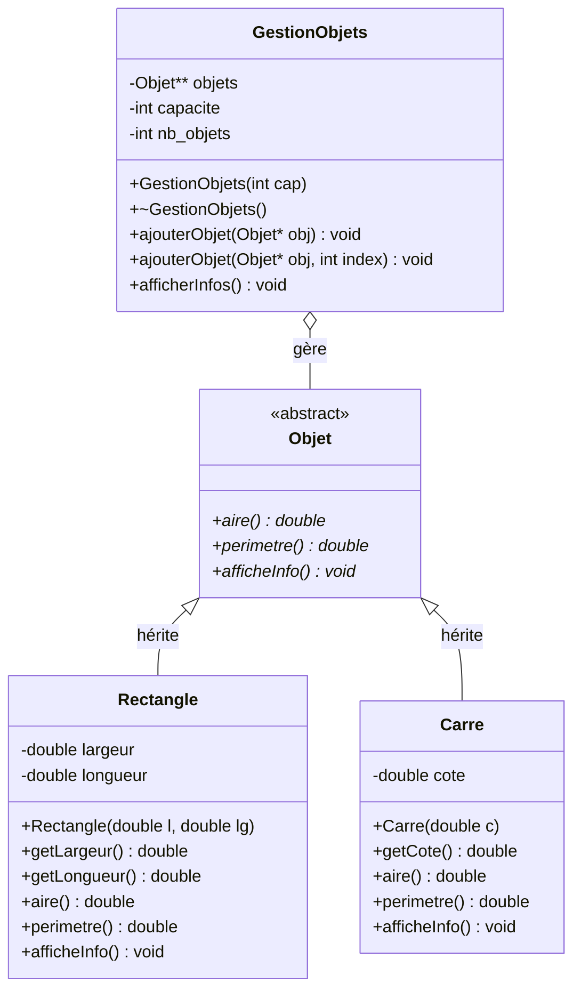
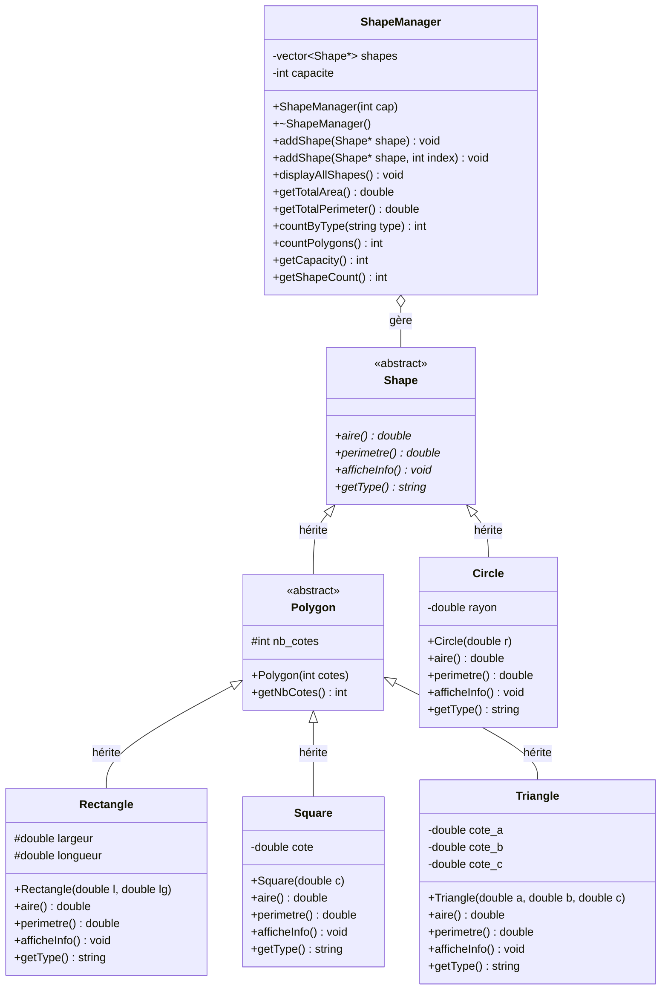

# Exercice 4 - Gestion d'Objets Géométriques

## Diagramme de classes (version de base)



## Solution

### Fichiers de base (Objet, Rectangle, Carre)

Les fichiers Objet.h, Rectangle.h, Rectangle.cpp, Carre.h et Carre.cpp sont identiques à l'exercice 3.

### Fichier: GestionObjets.h

```cpp
#ifndef GESTIONOBJETS_H
#define GESTIONOBJETS_H

#include "Objet.h"

class GestionObjets {
private:
    Objet** objets;     // Tableau dynamique de pointeurs vers des Objets
    int capacite;       // Capacité maximale du tableau
    int nb_objets;      // Nombre d'objets actuellement stockés

public:
    // Constructeur
    GestionObjets(int cap);

    // Destructeur
    ~GestionObjets();

    // Ajoute un objet à la prochaine position libre
    void ajouterObjet(Objet* obj);

    // Ajoute un objet à un index spécifique
    void ajouterObjet(Objet* obj, int index);

    // Affiche les informations de tous les objets stockés
    void afficherInfos();

    // Getters
    int getCapacite();
    int getNbObjets();
};

#endif
```

### Fichier: GestionObjets.cpp

```cpp
#include "GestionObjets.h"
#include <iostream>
using namespace std;

// Constructeur
GestionObjets::GestionObjets(int cap) {
    capacite = cap;
    nb_objets = 0;
    objets = new Objet*[capacite];

    // Initialisation à nullptr
    for (int i = 0; i < capacite; i++) {
        objets[i] = nullptr;
    }
}

// Destructeur - libère tous les objets stockés
GestionObjets::~GestionObjets() {
    for (int i = 0; i < capacite; i++) {
        if (objets[i] != nullptr) {
            delete objets[i];
        }
    }
    delete[] objets;
}

// Ajoute un objet à la prochaine position libre
void GestionObjets::ajouterObjet(Objet* obj) {
    if (nb_objets < capacite) {
        // Trouve la première position libre
        for (int i = 0; i < capacite; i++) {
            if (objets[i] == nullptr) {
                objets[i] = obj;
                nb_objets++;
                cout << "Objet ajouté à la position " << i << endl;
                return;
            }
        }
    } else {
        cout << "Erreur: La collection est pleine!" << endl;
    }
}

// Ajoute un objet à un index spécifique
void GestionObjets::ajouterObjet(Objet* obj, int index) {
    if (index >= 0 && index < capacite) {
        // Si une position est déjà occupée, on libère l'ancien objet
        if (objets[index] != nullptr) {
            delete objets[index];
            nb_objets--;
        }
        objets[index] = obj;
        nb_objets++;
        cout << "Objet ajouté à l'index " << index << endl;
    } else {
        cout << "Erreur: Index invalide!" << endl;
    }
}

// Affiche les informations de tous les objets
void GestionObjets::afficherInfos() {
    cout << "\n========================================" << endl;
    cout << "Affichage de tous les objets stockés" << endl;
    cout << "Nombre d'objets: " << nb_objets << "/" << capacite << endl;
    cout << "========================================\n" << endl;

    for (int i = 0; i < capacite; i++) {
        if (objets[i] != nullptr) {
            cout << "Position " << i << ":" << endl;
            objets[i]->afficheInfo();
            cout << endl;
        }
    }
}

// Getter pour capacite
int GestionObjets::getCapacite() {
    return capacite;
}

// Getter pour nb_objets
int GestionObjets::getNbObjets() {
    return nb_objets;
}
```

### Fichier: main.cpp

```cpp
#include <iostream>
#include "GestionObjets.h"
#include "Rectangle.h"
#include "Carre.h"
using namespace std;

int main() {
    cout << "=== Test de la classe GestionObjets ===" << endl;
    cout << endl;

    // Création d'une collection pouvant stocker 5 objets
    GestionObjets collection(5);

    cout << "--- Ajout d'objets sans spécifier l'index ---" << endl;

    // Création et ajout de rectangles
    collection.ajouterObjet(new Rectangle(5.0, 10.0));
    collection.ajouterObjet(new Rectangle(3.0, 7.0));

    // Création et ajout de carrés
    collection.ajouterObjet(new Carre(4.0));
    collection.ajouterObjet(new Carre(6.5));

    cout << endl;
    cout << "--- Ajout d'un objet à un index spécifique ---" << endl;

    // Ajout à l'index 4 (dernière position)
    collection.ajouterObjet(new Rectangle(2.0, 8.0), 4);

    // Affichage de tous les objets
    collection.afficherInfos();

    cout << "--- Remplacement d'un objet à l'index 1 ---" << endl;

    // Remplace l'objet à l'index 1
    collection.ajouterObjet(new Carre(10.0), 1);

    // Affichage après modification
    collection.afficherInfos();

    cout << "--- Statistiques de la collection ---" << endl;
    cout << "Nombre total d'objets: " << collection.getNbObjets() << endl;
    cout << "Capacité maximale: " << collection.getCapacite() << endl;

    return 0;
}
```

## Compilation et Exécution

```bash
# Compilation (en incluant tous les fichiers nécessaires)
g++ -o gestion main.cpp Rectangle.cpp Carre.cpp GestionObjets.cpp

# Exécution
./gestion
```

## Résultat attendu

```
=== Test de la classe GestionObjets ===

--- Ajout d'objets sans spécifier l'index ---
Objet ajouté à la position 0
Objet ajouté à la position 1
Objet ajouté à la position 2
Objet ajouté à la position 3

--- Ajout d'un objet à un index spécifique ---
Objet ajouté à l'index 4

========================================
Affichage de tous les objets stockés
Nombre d'objets: 5/5
========================================

Position 0:
=== Rectangle ===
Largeur: 5
Longueur: 10
Aire: 50
Périmètre: 30

Position 1:
=== Rectangle ===
Largeur: 3
Longueur: 7
Aire: 21
Périmètre: 20

Position 2:
=== Carré ===
Côté: 4
Aire: 16
Périmètre: 16

Position 3:
=== Carré ===
Côté: 6.5
Aire: 42.25
Périmètre: 26

Position 4:
=== Rectangle ===
Largeur: 2
Longueur: 8
Aire: 16
Périmètre: 20

--- Remplacement d'un objet à l'index 1 ---
Objet ajouté à l'index 1

========================================
Affichage de tous les objets stockés
Nombre d'objets: 5/5
========================================

Position 0:
=== Rectangle ===
Largeur: 5
Longueur: 10
Aire: 50
Périmètre: 30

Position 1:
=== Carré ===
Côté: 10
Aire: 100
Périmètre: 40

Position 2:
=== Carré ===
Côté: 4
Aire: 16
Périmètre: 16

Position 3:
=== Carré ===
Côté: 6.5
Aire: 42.25
Périmètre: 26

Position 4:
=== Rectangle ===
Largeur: 2
Longueur: 8
Aire: 16
Périmètre: 20

--- Statistiques de la collection ---
Nombre total d'objets: 5
Capacité maximale: 5
```

## Points clés de la solution

1. **Collection polymorphique**: GestionObjets stocke des pointeurs de type Objet*, permettant de gérer à la fois des Rectangle et des Carre

2. **Surcharge de méthode**: Deux versions de `ajouterObjet()`
   - Sans index: ajoute à la prochaine position libre
   - Avec index: ajoute à une position spécifique

3. **Gestion mémoire**:
   - Allocation dynamique du tableau dans le constructeur
   - Libération complète dans le destructeur
   - Suppression de l'ancien objet lors du remplacement

4. **Parcours de collection**: La méthode `afficherInfos()` parcourt tous les objets et appelle leur méthode `afficheInfo()` grâce au polymorphisme

5. **Compteur d'objets**: `nb_objets` garde trace du nombre d'objets réellement stockés

## Concepts avancés illustrés

- **Container class**: GestionObjets est un conteneur qui gère une collection d'objets
- **Polymorphisme runtime**: Les méthodes virtuelles permettent d'appeler la bonne version selon le type réel
- **RAII (Resource Acquisition Is Initialization)**: Les ressources sont acquises dans le constructeur et libérées dans le destructeur
- **Memory management**: Gestion explicite de la mémoire dynamique
- **Method overloading**: Deux méthodes avec le même nom mais des signatures différentes

---

## Version évolutive : Gestionnaire de formes avancé

Pour un système plus complet et moderne, on peut créer un gestionnaire qui :
- Gère une hiérarchie de formes plus riche (Shape → Polygon/Circle)
- Utilise `std::vector` au lieu de tableaux C bruts
- Offre des fonctionnalités avancées (comptage par type, statistiques)

### Diagramme UML de la version évolutive



### Avantages de cette architecture

1. **Utilisation de `std::vector`** (C++ moderne)
   - Gestion automatique de la mémoire
   - Taille dynamique
   - Méthodes utilitaires (push_back, size, clear, etc.)

2. **Fonctionnalités avancées** :
   - `getTotalArea()` : Calcule l'aire totale de toutes les formes
   - `getTotalPerimeter()` : Calcule le périmètre total
   - `countByType()` : Compte les formes d'un type spécifique
   - `countPolygons()` : Utilise `dynamic_cast` pour compter les polygones

3. **Identification dynamique** :
   ```cpp
   manager.countByType("Rectangle");  // Compte les rectangles
   manager.countByType("Circle");     // Compte les cercles
   manager.countPolygons();           // Compte tous les polygones
   ```

4. **Surcharge de méthode** :
   ```cpp
   // Ajout automatique à la prochaine position
   manager.addShape(new Circle(5.0));

   // Ajout à un index spécifique
   manager.addShape(new Rectangle(3.0, 4.0), 2);
   ```

### Code source disponible

L'implémentation complète de cette version évolutive est disponible dans le dossier [src/](src/).

**Compilation et exécution :**
```bash
cd src/
make
./gestion
```

### Exemple de sortie

```
=== Test de la classe ShapeManager ===

--- Ajout de formes sans spécifier l'index ---
Forme ajoutée à la position 0
Forme ajoutée à la position 1
Forme ajoutée à la position 2
Forme ajoutée à la position 3
Forme ajoutée à la position 4

--- Statistiques de la collection ---
Nombre total de formes: 5
Capacité maximale: 10
Aire totale: 176.266
Périmètre total: 115.133

--- Comptage par type ---
Rectangles: 2
Carrés: 1
Cercles: 1
Triangles: 1
Total de polygones: 4
```

### Comparaison : Tableaux C vs std::vector

| Aspect | Tableau C (`Shape**`) | `std::vector<Shape*>` |
|--------|----------------------|----------------------|
| **Allocation** | Manuelle (`new[]`) | Automatique |
| **Libération** | Manuelle (`delete[]`) | Automatique |
| **Redimensionnement** | Impossible | Facile (`resize()`, `push_back()`) |
| **Taille** | Variable à gérer manuellement | `size()` intégré |
| **Sécurité** | Risque d'erreurs de gestion mémoire | Plus sûr |
| **Performance** | Légèrement plus rapide | Quasi-identique |
| **Modernité** | C/C++ classique | C++ moderne (STL) |

### Recommandation

Pour du code moderne en C++, préférez **`std::vector`** :
- Plus sûr (moins de fuites mémoire)
- Plus lisible
- Plus facile à maintenir
- Conforme aux bonnes pratiques C++11/14/17

